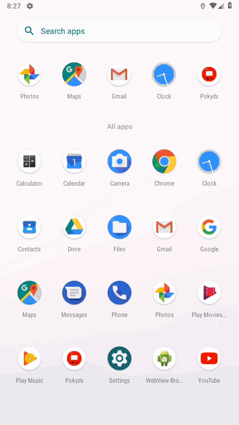

# Pokydx

A mini-encyclopedia of Pokémon species, types, evolutions, and moves.

This project uses Pokeapi to access data about Pokemon. Dataset of all the pokemon list is got from Data.world

# Demo

## Getting Started
**Note:** Make sure your Flutter environment is setup.

#### Installation

In the command terminal, run the following commands:

    $ git clone https://github.com/MohammedAkhil/pokydx
    $ cd pokydx/
    $ flutter run

# Simulate for iOS
#### Method One

    Open the project in Xcode from ios/Runner.xcodeproj.
    Hit the play button.

#### Method Two

    Run the following command in your terminal.
    $ open -a Simulator
    $ flutter run

# Simulate for Android

    Make sure you have an Android emulator installed and running.
    Run the following command in your terminal.
    $ flutter run

##### Check out Flutter’s online [documentation](http://flutter.io/) for help getting start with your Flutter project.

Feel free to add issues with bugs or ideas. Any pull requests are very welcome!

## Contributors

Thanks goes to these wonderful people ([emoji key](https://allcontributors.org/docs/en/emoji-key)):

<!-- ALL-CONTRIBUTORS-LIST:START - Do not remove or modify this section -->
<!-- prettier-ignore -->
<table><tr><td align="center"><a href="https://github.com/MohammedAkhil"> <b>Mohammed Akhil</b></a> <a href="#design-MohammedAkhil" title="Design">🎨</a> <a href="https://github.com/yogeshvar/pokydx/commits?author=MohammedAkhil" title="Code">💻</a> <a href="#ideas-MohammedAkhil" title="Ideas, Planning, & Feedback">🤔</a></td><td align="center"><a href="https://github.com/yogeshvar"> <b>Maggie Yogeshvar</b></a> <a href="https://github.com/yogeshvar/pokydx/commits?author=yogeshvar" title="Documentation">📖</a></td></tr></table>

<!-- ALL-CONTRIBUTORS-LIST:END -->

This project follows the [all-contributors](https://github.com/all-contributors/all-contributors) specification. Contributions of any kind welcome!
